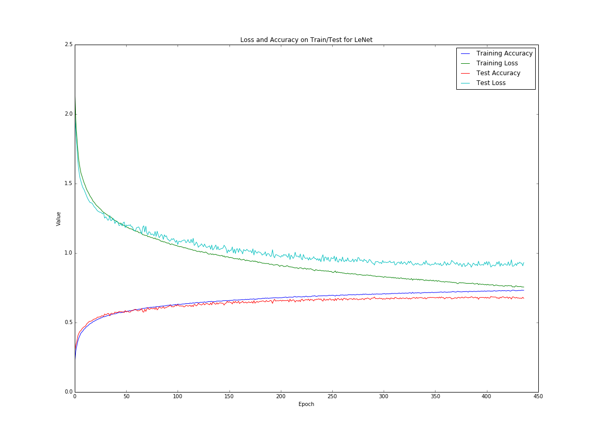
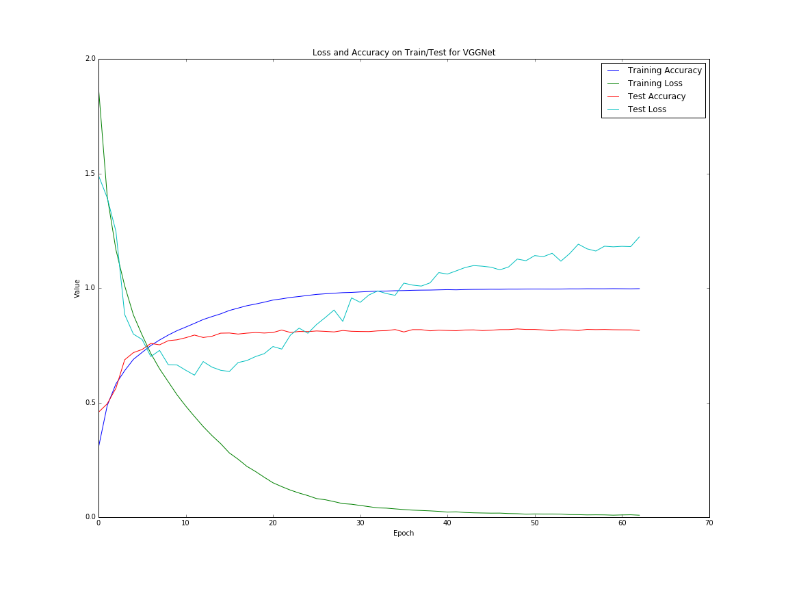
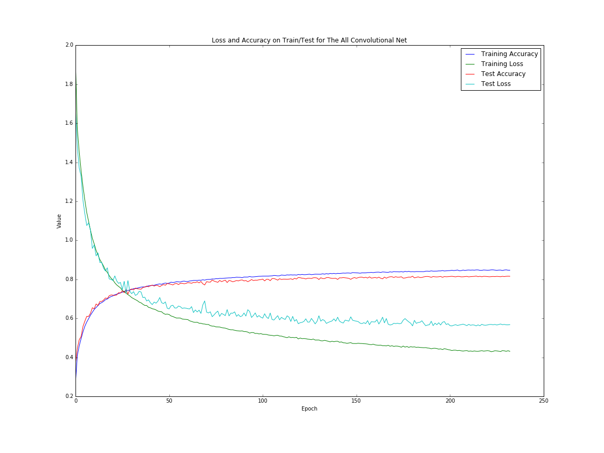

# Battle of the Nets

A performance comparison of LeNet, VGGNet, and The All Convolutional Net architectures on CIFAR-10 implemented using Keras.

Any parameters not explicitely specified in the papers you are free to set on your own. Outdated implementations (like using a sigmoidal activation function between layers) may be replaced with more modern implementations (like ReLU). It's also possible that Keras doesn't have the functionality used in the paper. In that case approximate with a different function [or implement the missing function on your own and submit a pull request :-)]. Specific net comments below.

### LeNet
Generalize to work with RGB images. Feel free to change or simplify aspects of the network that were designed specifically with handwritten digit recognition in mind.

### VGGNet
Use ConvNet Configuration B or C as a base model. Notice that the input and output sizes in the paper (224\*224\*3 and 1000\*1) is different from CIFAR-10's inputs and outputs (32\*32\*3 and 10\*1), so you won't be able to emulate the configuration exactly. But try to preserve the spirit of the architecture (hint: go deep).

### All Convolutional Net
Replace the pooling layers using option (2). Use Model A, B, or C as a base model.

## Results

Included in the repository is a Jupyter Notebook of one specific implementation/interpretation of the three convnets. 

### LeNet Learning Curve

### VGGNet Learning Curve

### All Convolutional Net Learning Curve

But all of the convnets performed better than this in their respective papers! What went wrong?

Firstly, the All Convolutional Net was the only convnet actually designed to be used on CIFAR-10, the others were only LeNet inspired, or VGGNet inspired.
As for the LeNet architecture: it was based on a paper that was published in 1998, a paper on hand-written digit recognition nonetheless - so it can be forgiven for performing poorly on CIFAR-10.
As for VGGNet: notice how quickly it converges. It has more or less learned all it is ever going to learn by the 20th epoch. And even before that, by the **10th** epoch, it is already overfitting, as can be seen by the increasing validation loss.

The All Convolutional Net is a slightly trickier case. It had converged by the 100th epoch. This is actually quite fast, considering that in its corresponding paper the authors do not decrease the learning rate until the 200th epoch and train the network a total of 350 epochs. Furthermore, their learning rate schedule was determined in experiments on their simplest model (model A) whereas here we implemented model B - a model with more complexity that you would expect would take longer to converge. It is my guess that one of the hyperparameters not specified in the paper, the weight initialization method, may be responsible for this relatively quick convergence to a local minima. By default, Keras uses Glorot initialization, a method first proposed in 2014. The All Convolutional Net paper was accepted as a workshop contribution at ICLR 2015, so they may not have been able to incorporate Glorot initialization into their training. The VGGNet paper was also a workshop contribution at ICLR 2015, and the authors of that paper explicitely state that Glorot and Bengio's paper came out too late for them to incorporate it into their training methods.

I would then recommend training the All Convolutional Net with an optimization method that adapts its learning rate to the optimization landscape or to use a heuristic to decrease the learning rate when improvement in validation accuracy begins to slow. 

There remains one more mystery. The All Convolutional Net's training accuracy is only a slight improvement over the validation accuracy (you would expect it to converge to 1, as in VGGNet). This suggests that there may be something more sinister going on than an overly eager learning rate. This will require more investigation to draft a hypothesis. 
